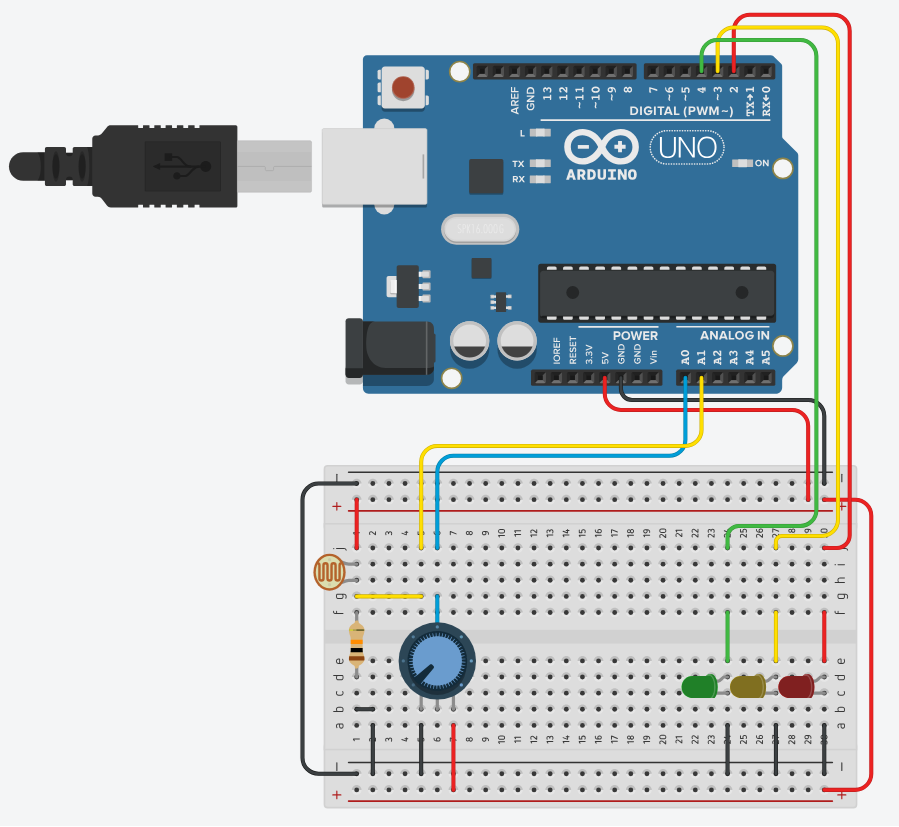
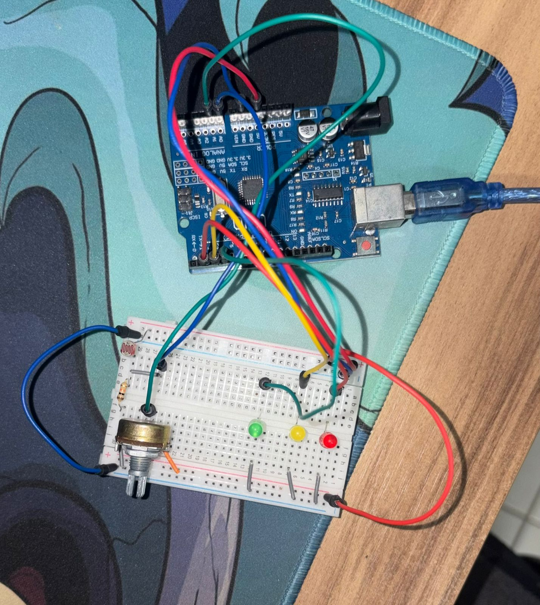

<div align="center">

# 🚦 Semáforo Inteligente com LDR

**Semáforo funcional com modo noturno automático via sensor de luminosidade**

[](https://www.arduino.cc/)
[](https://isocpp.org/)
[](https://choosealicense.com/licenses/mit/)

</div>

---

## 📋 Descrição

O **Semáforo Inteligente** simula um semáforo real com temporização precisa e troca automática de modo. Em condições normais, os LEDs seguem a sequência Verde → Amarelo → Vermelho. Quando o LDR detecta luminosidade baixa (simulando a noite), o sistema entra no **modo noturno**: o LED amarelo pisca continuamente, replicando o comportamento de semáforos reais em horários de baixo tráfego.

O potenciômetro permite ajustar o limiar de sensibilidade do LDR em tempo real, sem precisar modificar o código.

---

## ⚙️ Componentes Utilizados

| Quantidade | Componente | Especificação |
|:---:|---|---|
| 1x | Arduino Uno (ou compatível) | Microcontrolador ATmega328P |
| 1x | LED Vermelho | Pino D2 |
| 1x | LED Amarelo | Pino D3 |
| 1x | LED Verde | Pino D4 |
| 3x | Resistores para LEDs | 220Ω (limitadores de corrente) |
| 1x | LDR (fotoresistor) | Resistência: ~1kΩ (luz) a ~1MΩ (escuro) |
| 1x | Resistor de pull-down | 10kΩ (divisor de tensão com o LDR) |
| 1x | Potenciômetro | 10kΩ |
| — | Jumper wires | Macho-macho |
| 1x | Protoboard | — |

---

## 🔌 Pinagem

```
Arduino Uno
├── D2  → LED Vermelho + resistor 220Ω → GND
├── D3  → LED Amarelo  + resistor 220Ω → GND
├── D4  → LED Verde    + resistor 220Ω → GND
├── A0  → Saída do divisor de tensão (LDR + 10kΩ)   [INPUT analógico]
└── A1  → Cursor do potenciômetro                    [INPUT analógico]

Divisor de tensão (LDR):
5V → LDR → nó A0 → 10kΩ → GND

Potenciômetro:
Pino 1 (esq.) → 5V
Pino 2 (meio) → A1
Pino 3 (dir.) → GND
```

---

## 🖼️ Esquemático




---

## 💻 Como Funciona

### Máquina de Estados

O sistema é implementado como uma máquina de estados com 5 estados:

```
VERDE → AMARELO → VERMELHO → VERDE ...
         ↓ (se modoNoturno == true)
   NOTURNO_ON ↔ NOTURNO_OFF
```

### Temporizações

| Estado | Duração |
|---|:---:|
| Verde | 5000 ms |
| Amarelo | 2000 ms |
| Vermelho | 5000 ms |
| Noturno ON (amarelo aceso) | 500 ms |
| Noturno OFF (amarelo apagado) | 500 ms |

### Detecção do Modo Noturno

A cada ciclo do `loop()`, o Arduino lê o LDR e o potenciômetro:

```cpp
int valorLDR  = analogRead(PIN_LDR);   // luminosidade atual
int limiar    = analogRead(PIN_POT);   // limiar ajustável
bool modoNoturno = (valorLDR < limiar);
```

Quando `valorLDR < limiar`, o sistema entra imediatamente no modo noturno e pisca o amarelo. Ao retornar à claridade, volta para o Verde no ciclo normal.

### Sem delay()

O código usa exclusivamente `millis()` para temporização, sem nenhum `delay()`. Isso garante que a transição entre modos seja instantânea e responsiva.

### Monitoramento Serial

O estado atual é enviado para o Serial Monitor a cada ciclo:

```
LDR: 312 | Limiar: 520 | Noturno: NAO
LDR: 85  | Limiar: 520 | Noturno: SIM
```

---

## 🗂️ Estrutura dos Arquivos

```
Semaforo_Inteligente/
├── readme.md                                        # Esta documentação
├── post_linkedin.txt                                # Post para LinkedIn
├── sketch_semaforo_inteligente/
│   └── sketch_semaforo_inteligente.ino              # Código completo do projeto
└── circuit_images/
    ├── image_simulador.png                          # Simulação no Wokwi/Tinkercad
    └── Circuito_real.jpg                            # Foto do circuito físico montado
```

---

## 🚀 Como Usar

1. **Monte o circuito** conforme o esquemático.
2. **Abra o sketch:** `sketch_semaforo_inteligente/sketch_semaforo_inteligente.ino` no Arduino IDE.
3. **Selecione a placa:** `Tools → Board → Arduino Uno`.
4. **Selecione a porta:** `Tools → Port → COMx`.
5. **Faça upload:** `Ctrl+U`.
6. **Gire o potenciômetro** para ajustar o limiar de sensibilidade do LDR.
7. **Cubra o LDR** com a mão para simular o modo noturno e ver o pisca-alerta.
8. Abra o **Serial Monitor** (`Ctrl+Shift+M`, baud rate 9600) para ver os valores em tempo real.

---

*Desenvolvido por Felipe Grolla*

